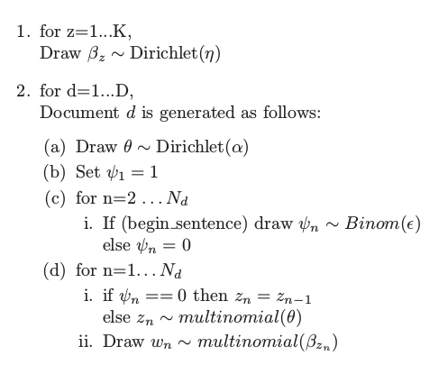

## Hidden Markov Models Overview

- System of tokens, assumed to be a Markov Process.
- State sequence is "hidden", but tokens (which depend on state) are visible.
- Each state has a probability distribution over the possible tokens.
- Sequence of tokens generated by an HMM gives some information about the sequence of states.

## Hidden Markov Models Example

Task: Given a sentence, determine the most likely sequence for its parts of speech.\footnote{Source: https://www.youtube.com/watch?v=7glSTzgjwuU}

- Some information is known based on prior data
    - States are parts of speech, tokens are the words.
    - $p(s' | s)$ - probability of transitioning from one state (part of speech) to another. Example: $p(\texttt{noun -> verb}) = 0.9$
    - $p(\texttt{word} | s)$ - probability of token (word) given a state. Example: $p(\texttt{"Blue"} | \texttt{noun}) = 0.4$
- Traverse the words to compute probability of each sequence.
- Sentence: $\textit{The blue bank closed.}$
- $p(\texttt{det, adj, noun, verb}) = p(\texttt{"the" | det}) \cdot p(\texttt{adj | det}) \cdot p(\texttt{"blue" | adj}) \cdot ...$

## Hidden Topic Markov Models Introduction

- Topics in a document are hidden and should be extracted.
- $\textit{Bag of words}$ is an unrealistic oversimplification.
- Topics should only transition at the beginning of a new sentence.
- Each document has a $\theta_d$ vector, representing its topic distribution.
- Topics transition based on binomial transition variable $\psi_n \in {0,1}$ for every word $w_1 ... w_{N_d}$ in a document.

## HTMM vs. LDA Visually

  

- HTMM (top) segments by sentence, LDA (bottom) segments only individual words.

## HTMM Definition

## HTMM Definition (Annotated)

- For every latent topic $z=1...K$, draw a $\beta_z \sim Dirichlet(\eta)$
- Generate each document $d=1...D$ as follows:
    - Draw a topic distribution $\theta \sim Dirichlet(\alpha)$
    - Word 1 is a \textit{new} topic, $\psi_1 = 1$
    - For every word $n=2...N_d$:
        - If it's the first word in a sentence, draw $\psi_1 \sim Binom(\epsilon)$, otherwise no topic transition $\psi_1  = 0$
    - For every word $n=1...N_d$:
        - If $\psi_n == 0$, topic doesn't change: $z_n = z_{n-1}$.
        - Else draw new $z_n \sim multinomial(\theta)$
        - Draw $w_n \sim multinomial(\beta_{z_n})$

## Parameter Approximation

{height=70%}

## Parameter Approximation (cont.)

Use Estimation-Maximization Algorithm (EM)

- EM for HMMs distinguishes between latent variables (topics $z_n$, transition variables $\psi_n$) and parameters.
- Estimation step uses Forward-Backward Algorithm

Unknown Parameters

- $\theta_d$ - topic distribution for each document
- $\beta$ - used for multinomial word distributions
- $\epsilon$ - used for binomial topic transition variables

Known Parameters

- Based on prior research
- $\alpha = 1 + \frac{50}{K}$ - used for drawing $\theta \sim Dirichlet(\alpha)$
- $\eta = 1.01$ - used for drawing $\beta_z \sim Dirichlet(\eta)$

## Experiment: NIPS Dataset

Data

- 1740 documents, 1557 training, 183 testing.
- 12113 words in vocabulary.
- Extract vocabulary words, preserving order.
- Split sentences on punctuation $\texttt{. ? ! ; }$

Metric

- Perplexity for HTMM vs. LDA vs. VHTMM1\footnote{VHTMM1 uses constat $\psi_n = 1$ so every sentence is of a new topic.}
- *Perplexity reflects the difficulty of predicting a new unseen document after learning from a training set*, lower is better.

## Figure 2: Perplexity as a function of observed words

{height=50%}

- HTMM is significantly better than LDA for $N \leq 64$.
- Average document length is 1300 words.

## Figure 3: topical segmentation in HTMM

{height=50%}

- HTMM attributes "Support" to two different topics, mathematical and acknowledgments.

## Figure 5: topical segmentation in LDA

{height=50%}

- LDA attributes "Support" to only one topic.

## Figure 6: Perplexity as a function of $K$

{height=50%}

- Each topic limited to $N = 10$ words.

## Figure 7: $\epsilon$ as a function of $K$

{height=50%}

- Fewer topics $\rightarrow$ lower $\epsilon$ $\rightarrow$ infrequent transitions.
- More topics $\rightarrow$ higher $\epsilon$ $\rightarrow$ frequent transitions.

## Table 1: Lower perplexity due to degrees of freedom?

- *Eliminate the option that the perplexity of HTMM might be lower than the perplexity of LDA only because it has less degrees of freedom (due to the dependencies between latent topics).*
- Generate and train on two datasets, $D = 1000$, $V = 200$, $K = 5$
- Dataset 1 generated with HTMM with $\epsilon = 0.1$ (likely to transition topics).
- Dataset 2 generated with LDA "bag of words".
- HTMM still learns the correct parameters and outperforms on ordered data, does not outperform on "bag of words" data.
- Careful: *maybe bag of words was just a bad assumption for the NIPS dataset*.

## Conclusion

Authors' Conclusion

- HTMM should be considered an extension of LDA.
- Markovian structure can learn more coherent topics, disambiguate topics of ambiguous words.
- Efficient learning and inference algorithms for HTMM already exist.

Questions

- Why only one dataset?
- How does it perform on unstructured speech? For example: run-on sentences or transcripts of live speech, debates, etc.
- Why is $\psi_n$ necessary for every word, could you just consider the first words?

## Thoughts for Project

Maybe shopping trips follow a Markov Model

- A shopper who purchases a crib on one store visit then diapers on the next visit might be having a baby soon.
- *These may be purchased with many other unrelated items, but there is still some meaning to them.*
- Extracting the crib, diapers, etc. sequence could help determine this meaning, whereas treating each shopping trip independently might ignore it.
